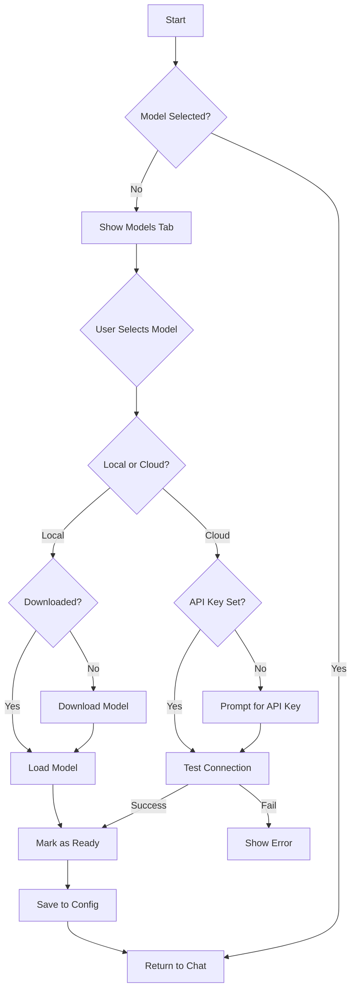

# PROJECT FRANK - Complete Specification

> A polyglot AI assistant framework with advanced TUI, multi-model support, and intelligent enrichment

**Version**: 2.0
**Status**: In Development
**Last Updated**: 2025-11-21

---

## Table of Contents

1. [Overview](#overview)
2. [Current Status](#current-status)
3. [CLI/TUI System](#clitui-system)
4. [Model Management](#model-management)
5. [Enrichment Pipeline](#enrichment-pipeline)
6. [Architecture](#architecture)
7. [Implementation Roadmap](#implementation-roadmap)
8. [Technical Details](#technical-details)

---

## Overview

### Vision

Project Frank is a unified AI assistant framework that combines:
- **Multi-language architecture**: Rust (orchestrator) + Python (AI/NLP) + Go (domain handlers) + C++ (performance)
- **Flexible model support**: Local models (Phi-3, Llama, etc.) + Cloud APIs (OpenAI, Gemini)
- **Intelligent enrichment**: Automated data gathering from MusicBrainz → Wikidata → Wikipedia
- **Professional TUI**: Tabbed interface with model management, chat, and logs

### Core Principles

1. **User Choice**: Let users choose their AI model (local or cloud)
2. **Privacy First**: Local models for private use, cloud for power
3. **Smart Enrichment**: Automatically gather context from multiple sources
4. **Clean UX**: Professional, intuitive terminal interface
5. **Extensible**: Easy to add new models, data sources, and features

---

## Current Status

### ✅ What's Working

- [x] Multi-language FFI (Rust ↔ Python ↔ Go ↔ C++)
- [x] SQLite caching with TTL
- [x] Basic TUI with input/output
- [x] Phi-3 local model integration
- [x] Enrichment pipeline (MusicBrainz, Wikidata, Wikipedia)
- [x] Intent classification
- [x] Go domain handlers (music, sports)

### 🚧 Known Issues

- [ ] Character doubling in input (Crossterm issue)
- [ ] Messy terminal output (tests mixed with UI)
- [ ] No model selection UI
- [ ] No persistence of settings
- [ ] Limited error handling

### 📋 Planned Features

- [ ] Tabbed TUI interface
- [ ] Model management system
- [ ] Download manager for HuggingFace models
- [ ] OpenAI and Gemini integration
- [ ] Advanced enrichment with streaming
- [ ] Command system (slash commands)
- [ ] Better logging and debugging

---

## CLI/TUI System

### Design Philosophy

**Goal**: Create a professional, intuitive terminal interface that feels like a modern IDE.

**Key Features**:
- Tab-based navigation (not overwhelming)
- Arrow keys for navigation (natural)
- Status bar with context
- Clean, minimal design
- No clutter or noise

### Tab Structure

```
┌─ PROJECT FRANK ────────────────────────────────────────────────┐
│ [Chat] [Models] [Logs] [Settings]                    Model: None│
├────────────────────────────────────────────────────────────────┤
│                                                                │
│                      CURRENT TAB CONTENT                       │
│                                                                │
├────────────────────────────────────────────────────────────────┤
│ ← → Navigate Tabs | ↑ ↓ Scroll | Enter: Send | /help: Commands│
└────────────────────────────────────────────────────────────────┘
```

### Tab 1: Chat

**Purpose**: Main conversation interface with AI

**Layout**:
```
┌─ CHAT ─────────────────────────────────────────────────────────┐
│                                                                │
│ > User: what is machine learning?                             │
│                                                                │
│ 🤖 Assistant (Phi-3 Mini):                                    │
│ Machine learning is a subset of artificial intelligence...    │
│                                                                │
│ 📊 Enrichment: MusicBrainz → Wikidata → Wikipedia            │
│ - Found 3 relevant articles                                   │
│                                                                │
├────────────────────────────────────────────────────────────────┤
│ 💬 Type your message...                                       │
└────────────────────────────────────────────────────────────────┘
```

**Features**:
- Conversation history (scrollable)
- Enrichment data display (collapsible)
- Streaming responses (token-by-token)
- Copy to clipboard
- Clear conversation
- Export chat history

**Commands**:
- `/clear` - Clear conversation
- `/export` - Export chat to file
- `/model <name>` - Switch model
- `/enrich <query>` - Force enrichment
- `/help` - Show commands

### Tab 2: Models

**Purpose**: Model selection and management

**Layout**:
```
┌─ MODELS ───────────────────────────────────────────────────────┐
│                                                                │
│ LOCAL MODELS (No API Key Required)                            │
│ ┌──────────────────────────────────────────────────────────┐  │
│ │ ○ Phi-3 Mini 4K        [Downloaded] [Select]            │  │
│ │ ○ Llama 3.2 1B         [Download]   [Info]              │  │
│ │ ○ TinyLlama 1.1B       [Download]   [Info]              │  │
│ └──────────────────────────────────────────────────────────┘  │
│                                                                │
│ CLOUD MODELS (API Key Required)                               │
│ ┌──────────────────────────────────────────────────────────┐  │
│ │ ○ GPT-4 Turbo         [Configure API] [Info]            │  │
│ │ ○ GPT-3.5 Turbo       [Configure API] [Info]            │  │
│ │ ○ Gemini Pro          [Configure API] [Info]            │  │
│ └──────────────────────────────────────────────────────────┘  │
│                                                                │
├────────────────────────────────────────────────────────────────┤
│ Selected: None | Space: Select | D: Download | A: Add API Key │
└────────────────────────────────────────────────────────────────┘
```

**Features**:
- Visual model list with status
- Download progress for local models
- API key configuration
- Model info (size, requirements, capabilities)
- Auto-save last selected model
- Quick switch (keyboard shortcuts)

**Model States**:
- 🔵 Available (not downloaded)
- 🟢 Ready (downloaded/configured)
- ⚪ Selected (currently active)
- 🔴 Error (missing API key, download failed)

### Tab 3: Logs

**Purpose**: System logs, debug info, and enrichment details

**Layout**:
```
┌─ LOGS ─────────────────────────────────────────────────────────┐
│                                                                │
│ [INFO]  2025-11-21 12:00:00 - Model loaded: Phi-3 Mini        │
│ [DEBUG] 2025-11-21 12:00:01 - Enrichment query: beatles       │
│ [INFO]  2025-11-21 12:00:02 - MusicBrainz: Found 5 results    │
│ [INFO]  2025-11-21 12:00:03 - Wikidata: Retrieved Q1299       │
│ [INFO]  2025-11-21 12:00:04 - Wikipedia: Article loaded       │
│ [DEBUG] 2025-11-21 12:00:05 - Cache hit: beatles              │
│ [WARN]  2025-11-21 12:00:06 - High memory usage: 4.2GB        │
│                                                                │
├────────────────────────────────────────────────────────────────┤
│ Filter: [All] INFO DEBUG WARN ERROR | C: Clear | S: Save      │
└────────────────────────────────────────────────────────────────┘
```

**Features**:
- Real-time log streaming
- Log level filtering
- Search logs
- Export logs to file
- Auto-scroll toggle
- Copy selected logs

**Log Categories**:
- System (startup, shutdown, errors)
- Model (loading, inference, errors)
- Enrichment (API calls, cache hits)
- User (queries, commands)

### Tab 4: Settings

**Purpose**: Configuration and preferences

**Layout**:
```
┌─ SETTINGS ─────────────────────────────────────────────────────┐
│                                                                │
│ API KEYS                                                       │
│ ┌──────────────────────────────────────────────────────────┐  │
│ │ OpenAI:      [********************] [Test] [Clear]       │  │
│ │ Gemini:      [Not configured]       [Add]               │  │
│ │ HuggingFace: [********************] [Test] [Clear]       │  │
│ └──────────────────────────────────────────────────────────┘  │
│                                                                │
│ PREFERENCES                                                    │
│ ┌──────────────────────────────────────────────────────────┐  │
│ │ Auto-save model:     [✓] Enabled                         │  │
│ │ Cache TTL:           [30] minutes                        │  │
│ │ Max tokens:          [512]                               │  │
│ │ Temperature:         [0.7]                               │  │
│ │ Theme:               [Dark] Light                        │  │
│ └──────────────────────────────────────────────────────────┘  │
│                                                                │
├────────────────────────────────────────────────────────────────┤
│ Space: Toggle | Enter: Edit | S: Save | R: Reset to Defaults  │
└────────────────────────────────────────────────────────────────┘
```

**Features**:
- API key management (secure input)
- Model preferences
- Cache configuration
- UI theme selection
- Export/import settings

---

## Model Management

### Model Types

#### 1. Local HuggingFace Models (No API Key)

**How it works**:
- Download model files from HuggingFace Hub
- Store locally in `~/.cache/huggingface/`
- Load with PyTorch/Transformers
- Run inference on GPU/CPU

**Supported Models**:
```json
{
  "local_models": [
    {
      "name": "Phi-3 Mini 4K",
      "model_id": "microsoft/Phi-3-mini-4k-instruct",
      "size": "7.6 GB",
      "ram_required": "8 GB",
      "best_for": "General chat, coding, reasoning"
    },
    {
      "name": "Llama 3.2 1B",
      "model_id": "meta-llama/Llama-3.2-1B-Instruct",
      "size": "2.5 GB",
      "ram_required": "4 GB",
      "best_for": "Fast responses, simple queries"
    },
    {
      "name": "TinyLlama 1.1B",
      "model_id": "TinyLlama/TinyLlama-1.1B-Chat-v1.0",
      "size": "2.2 GB",
      "ram_required": "3 GB",
      "best_for": "Low-resource environments"
    },
    {
      "name": "Qwen 2.5 0.5B",
      "model_id": "Qwen/Qwen2.5-0.5B-Instruct",
      "size": "1.0 GB",
      "ram_required": "2 GB",
      "best_for": "Ultra-fast, minimal resources"
    }
  ]
}
```

**Download Process**:
1. User selects model from list
2. Press 'D' to download
3. Show progress bar with ETA
4. Verify download integrity
5. Mark as "Downloaded"
6. Auto-select if it's the first model

#### 2. Cloud OpenAI Models (API Key Required)

**Configuration**:
```rust
{
  "provider": "openai",
  "api_key": "sk-...",
  "models": [
    {
      "name": "GPT-4 Turbo",
      "model_id": "gpt-4-turbo-preview",
      "cost_per_1k_tokens": "$0.01/$0.03"
    },
    {
      "name": "GPT-3.5 Turbo",
      "model_id": "gpt-3.5-turbo",
      "cost_per_1k_tokens": "$0.0005/$0.0015"
    }
  ]
}
```

**API Integration**:
- Use `openai` Rust crate or HTTP requests
- Stream responses token-by-token
- Handle rate limits and errors
- Show token usage and cost

#### 3. Cloud Gemini Models (API Key Required)

**Configuration**:
```rust
{
  "provider": "google",
  "api_key": "AIza...",
  "models": [
    {
      "name": "Gemini Pro",
      "model_id": "gemini-pro",
      "features": ["multimodal", "long_context"]
    },
    {
      "name": "Gemini Pro Vision",
      "model_id": "gemini-pro-vision",
      "features": ["vision", "multimodal"]
    }
  ]
}
```

**API Integration**:
- Use Google AI SDK or HTTP API
- Support streaming
- Handle multimodal inputs (future)

#### 4. Cloud HuggingFace Inference (API Key Optional)

**Use case**: Access large models without downloading

**Configuration**:
```rust
{
  "provider": "huggingface",
  "api_key": "hf_...",  // Optional for free tier
  "models": [
    {
      "name": "Mixtral 8x7B",
      "model_id": "mistralai/Mixtral-8x7B-Instruct-v0.1",
      "free_tier": true
    }
  ]
}
```

### Model Selection Flow



---

## Enrichment Pipeline

### Overview

**Goal**: Automatically gather context from multiple sources to enhance AI responses.

**Flow**: `MusicBrainz → Wikidata → Wikipedia`

### Data Sources

#### 1. MusicBrainz (Go Handler)

**Purpose**: Music metadata (artists, albums, tracks)

**API**: https://musicbrainz.org/ws/2/

**Go Implementation** (`go/frankgo.go`):
```go
//export go_music_query
func go_music_query(query *C.char, resultBuf *C.char, bufSize C.int) C.int {
    q := C.GoString(query)

    // Search MusicBrainz
    url := fmt.Sprintf("https://musicbrainz.org/ws/2/artist/?query=%s&fmt=json", url.QueryEscape(q))
    resp, err := http.Get(url)
    // ... handle response

    // Extract Wikidata ID if available
    wikidataID := extractWikidataID(jsonData)

    // Return enriched data
    result := map[string]interface{}{
        "source": "musicbrainz",
        "artist": artistName,
        "wikidata_id": wikidataID,
        "albums_count": albumCount,
    }

    return returnJSON(result, resultBuf, bufSize)
}
```

**Data Returned**:
- Artist name
- Wikidata ID
- Album count
- Genre tags
- Related artists

#### 2. Wikidata (Python Handler)

**Purpose**: Structured knowledge graph data

**API**: https://www.wikidata.org/w/api.php

**Python Implementation** (`python/enrichment_pipeline.py`):
```python
def fetch_wikidata(entity_id: str) -> dict:
    """Fetch entity data from Wikidata."""
    url = f"https://www.wikidata.org/wiki/Special:EntityData/{entity_id}.json"

    response = requests.get(url)
    data = response.json()

    # Extract relevant fields
    entity = data['entities'][entity_id]

    return {
        "label": entity['labels']['en']['value'],
        "description": entity['descriptions']['en']['value'],
        "wikipedia_title": get_wikipedia_title(entity),
        "properties": extract_properties(entity['claims'])
    }
```

**Data Returned**:
- Label and description
- Wikipedia article link
- Key properties (birth date, occupation, etc.)
- Related entities

#### 3. Wikipedia (Python Handler)

**Purpose**: Detailed article content

**API**: https://en.wikipedia.org/w/api.php

**Python Implementation**:
```python
def fetch_wikipedia(title: str) -> dict:
    """Fetch Wikipedia article summary."""
    url = "https://en.wikipedia.org/w/api.php"

    params = {
        "action": "query",
        "format": "json",
        "titles": title,
        "prop": "extracts",
        "exintro": True,
        "explaintext": True
    }

    response = requests.get(url, params=params)
    data = response.json()

    # Extract summary
    pages = data['query']['pages']
    page = list(pages.values())[0]

    return {
        "title": page['title'],
        "summary": page['extract'][:500],  # First 500 chars
        "url": f"https://en.wikipedia.org/wiki/{title.replace(' ', '_')}"
    }
```

**Data Returned**:
- Article title
- Summary (intro paragraph)
- Full URL
- Images (future)

### Enrichment Strategies

#### Strategy 1: Sequential (Current)

```
User Query → Intent → Domain Handler → MusicBrainz
                                          ↓
                                      Wikidata ID
                                          ↓
                                      Wikidata
                                          ↓
                                    Wikipedia Title
                                          ↓
                                      Wikipedia
                                          ↓
                                    Combined Result
```

**Pros**: Simple, clear data flow
**Cons**: Slow, sequential API calls

#### Strategy 2: Parallel (Planned)

```
User Query → Intent → Domain Handler ──┬→ MusicBrainz
                                       ├→ Wikidata
                                       └→ Wikipedia
                                          ↓
                                    Merge Results
```

**Pros**: Faster, concurrent API calls
**Cons**: May get incomplete linkages

#### Strategy 3: Streaming (Future)

```
User Query → Intent → Domain Handler → Stream Start
                                          ↓
                                    MusicBrainz (emit)
                                          ↓
                                    Wikidata (emit)
                                          ↓
                                    Wikipedia (emit)
                                          ↓
                                    Stream End
```

**Pros**: Progressive loading, better UX
**Cons**: Complex state management

### Caching System

**Purpose**: Avoid redundant API calls, respect rate limits

**Implementation** (`rust/src/cache.rs`):
```rust
pub struct EnrichmentCache {
    conn: Arc<Mutex<Connection>>,
    default_ttl: Duration,
}

impl EnrichmentCache {
    pub fn get(&self, key: &str) -> Result<Option<CacheRecord>> {
        // Check if cached and not expired
        // Return cached data if available
    }

    pub fn set(&self, key: &str, payload: &Value, ttl: Option<Duration>) -> Result<()> {
        // Store with expiration timestamp
    }

    pub fn purge_expired(&self) -> Result<()> {
        // Remove expired entries
    }
}
```

**Cache Keys**:
- Format: `{source}:{query_hash}`
- Example: `musicbrainz:beatles`

**TTL Strategy**:
- Default: 30 minutes
- User-configurable
- Different TTLs per source type

---

## Architecture

### System Overview

```
┌────────────────────────────────────────────────────────────┐
│                         USER                               │
│                          │                                 │
│                          ↓                                 │
│                    ┌──────────┐                            │
│                    │   TUI    │ (Rust)                     │
│                    │  main.rs │                            │
│                    └──────────┘                            │
│                          │                                 │
│         ┌────────────────┼────────────────┐                │
│         ↓                ↓                ↓                │
│   ┌─────────┐     ┌──────────┐    ┌──────────┐            │
│   │ Config  │     │  Intent  │    │  Cache   │ (Rust)     │
│   │ Manager │     │Classifier│    │  Layer   │            │
│   └─────────┘     └──────────┘    └──────────┘            │
│         │                │                │                │
│         └────────────────┼────────────────┘                │
│                          ↓                                 │
│              ┌───────────────────────┐                     │
│              │   Orchestrator        │ (Rust)              │
│              │  - Route queries      │                     │
│              │  - Manage FFI         │                     │
│              │  - Coordinate modules │                     │
│              └───────────────────────┘                     │
│                          │                                 │
│         ┌────────────────┼────────────────┐                │
│         ↓                ↓                ↓                │
│   ┌──────────┐    ┌──────────┐    ┌──────────┐            │
│   │ Python   │    │   Go     │    │   C++    │            │
│   │ AI       │    │ Domain   │    │ Process  │            │
│   │ Gateway  │    │ Handlers │    │   Ops    │            │
│   └──────────┘    └──────────┘    └──────────┘            │
│         │                │                │                │
│         ↓                ↓                ↓                │
│   [HuggingFace]   [MusicBrainz]    [Text Ops]             │
│   [OpenAI]        [Wikidata]                              │
│   [Gemini]        [Wikipedia]                             │
└────────────────────────────────────────────────────────────┘
```

### Module Responsibilities

#### Rust Layer

**main.rs**:
- TUI rendering (tabs, inputs, outputs)
- Event handling (keyboard, mouse)
- State management
- Error boundaries

**config.rs**:
- Load/save configuration
- Model registry
- API key management
- User preferences

**intent.rs**:
- Classify user queries
- Route to appropriate handler
- Extract entities

**cache.rs**:
- SQLite operations
- TTL management
- Cache invalidation

**api_chain.rs**:
- Python FFI bindings
- Model inference coordination
- Response streaming

**ffi.rs**:
- Go FFI bindings
- Domain handler calls
- Data serialization

#### Python Layer

**ai_gateway.py**:
- Model loading (local/cloud)
- Inference execution
- Response formatting
- Error handling

**enrichment_pipeline.py**:
- API orchestration
- Data merging
- Caching integration

#### Go Layer

**frankgo.go**:
- MusicBrainz queries
- Sports data (future)
- Weather data (future)
- News aggregation (future)

#### C++ Layer

**frankcpp.cpp**:
- Text processing
- Performance-critical operations
- Future: SIMD optimizations

---

## Implementation Roadmap

### Phase 1: CLI Foundation (Current Sprint)

**Goal**: Build the core TUI with model management

**Tasks**:
1. ✅ Create `config.rs` with persistence
2. ⏳ Build tabbed TUI with arrow key navigation
3. ⏳ Implement model selector UI
4. ⏳ Add download manager for local models
5. ⏳ Fix character doubling bug
6. ⏳ Add status bar and branding
7. ⏳ Test and polish

**Deliverables**:
- Working tabbed TUI
- Model selection and auto-save
- Clean, professional interface

**ETA**: 2-3 days

### Phase 2: Cloud Model Integration

**Goal**: Add OpenAI and Gemini support

**Tasks**:
1. Add OpenAI API integration
2. Add Gemini API integration
3. Implement API key management UI
4. Add cost tracking
5. Error handling and retries
6. Test with real APIs

**Deliverables**:
- Working cloud model support
- Secure API key storage
- Usage tracking

**ETA**: 3-4 days

### Phase 3: Enhanced Enrichment

**Goal**: Improve data gathering and presentation

**Tasks**:
1. Implement parallel API calls
2. Add more data sources (Spotify, TMDB)
3. Improve data merging logic
4. Add streaming enrichment
5. Better error recovery
6. Enhanced caching strategies

**Deliverables**:
- Faster enrichment
- More data sources
- Better UX

**ETA**: 4-5 days

### Phase 4: Advanced Features

**Goal**: Polish and extend functionality

**Tasks**:
1. Add conversation export
2. Implement command system
3. Add search functionality
4. Improve logging system
5. Add settings persistence
6. Performance optimizations

**Deliverables**:
- Feature-complete system
- Production-ready quality
- Full documentation

**ETA**: 5-7 days

---

## Technical Details

### Build System

**Tools**:
- Rust: cargo 1.70+
- Go: 1.21+
- Python: 3.11+
- C++: GCC 11+ or MSVC 2019+

**Build Process**:
```bash
# Windows
.\scripts\build_all.ps1

# Linux/macOS
./scripts\build_all.sh
```

**Output**:
- Rust binary: `rust/target/release/project-frank.exe`
- Go library: `libfrankgo.a` (static)
- C++ library: `libfrankcpp.a` (static)
- Python modules: Embedded via PyO3

### Dependencies

**Rust Crates**:
```toml
anyhow = "1.0"           # Error handling
crossterm = "0.27"       # Terminal control
ratatui = "0.26"         # TUI framework
rusqlite = "0.31"        # SQLite
serde = "1.0"            # Serialization
pyo3 = "0.20"            # Python FFI
dirs = "5.0"             # Config directories
```

**Python Packages**:
```
transformers >= 4.30
torch >= 2.0
openai >= 1.0          # For OpenAI API
google-generativeai    # For Gemini API
requests >= 2.28
```

**Go Modules**:
```go
// Currently minimal, will add:
// - HTTP client libraries
// - JSON parsing
// - Rate limiting
```

### Configuration Files

**Location**:
- Windows: `%APPDATA%\project-frank\config.json`
- Linux/macOS: `~/.config/project-frank/config.json`

**Format**:
```json
{
  "selected_model": "Phi-3 Mini (Local)",
  "models": [...],
  "openai_api_key": "sk-...",
  "gemini_api_key": "AIza...",
  "hf_api_key": null,
  "preferences": {
    "cache_ttl_minutes": 30,
    "max_tokens": 512,
    "temperature": 0.7,
    "theme": "dark"
  }
}
```

### Error Handling Strategy

**Levels**:
1. **Critical**: System failure, crash with message
2. **Error**: Feature broken, show error in UI
3. **Warning**: Degraded functionality, log and continue
4. **Info**: Normal operation, log for debugging

**User-Facing Errors**:
- Always actionable
- Include fix suggestions
- Never show stack traces
- Log full details to logs tab

### Security Considerations

**API Keys**:
- Never log API keys
- Store with appropriate permissions
- Option to use system keyring (future)
- Mask in UI

**Cache**:
- No sensitive data in cache
- Regular purging
- User-controlled deletion

**Network**:
- HTTPS only
- Certificate validation
- Timeout handling
- Rate limiting

---

## Testing Strategy

### Unit Tests

**Rust**:
```rust
#[cfg(test)]
mod tests {
    #[test]
    fn test_config_load_save() { ... }

    #[test]
    fn test_model_selection() { ... }

    #[test]
    fn test_cache_ttl() { ... }
}
```

**Python**:
```python
def test_phi3_inference():
    # Test model loading and inference
    pass

def test_enrichment_pipeline():
    # Test data gathering
    pass
```

**Go**:
```go
func TestMusicBrainzQuery(t *testing.T) {
    // Test API integration
}
```

### Integration Tests

**Scenarios**:
1. End-to-end query flow
2. Model switching
3. Enrichment pipeline
4. Cache persistence
5. Error recovery

### Manual Testing Checklist

- [ ] All tabs render correctly
- [ ] Arrow keys navigate tabs
- [ ] Model selection persists
- [ ] Downloads show progress
- [ ] API keys work
- [ ] Logs update in real-time
- [ ] No character doubling
- [ ] Clean startup/shutdown

---

## Documentation

### User Documentation

**README.md**: Overview and quick start
**SETUP.md**: Installation guide
**USER_GUIDE.md**: Full feature documentation
**FAQ.md**: Common questions

### Developer Documentation

**ARCHITECTURE.md**: System design
**API.md**: Module interfaces
**CONTRIBUTING.md**: Development guide
**CHANGELOG.md**: Version history

---

## Future Vision

### V3.0 Features (Aspirational)

- Web UI alternative to TUI
- Voice input/output
- Multi-modal support (images, audio)
- Plugin system for extensions
- Team collaboration features
- Cloud sync of conversations
- Mobile app (via API server mode)

### New Data Sources

- Spotify API
- TheMovieDB
- News APIs
- Weather services
- Stock market data
- Academic papers

### Advanced AI Features

- Multi-agent collaboration
- Tool use and function calling
- Long-term memory
- Personality customization
- Fine-tuning support

---

## Appendix

### Glossary

- **FFI**: Foreign Function Interface
- **TUI**: Terminal User Interface
- **TTL**: Time To Live (cache expiration)
- **HF**: HuggingFace
- **LLM**: Large Language Model

### References

- [Ratatui Documentation](https://ratatui.rs/)
- [PyO3 Guide](https://pyo3.rs/)
- [Crossterm Docs](https://docs.rs/crossterm/)
- [HuggingFace Hub](https://huggingface.co/docs/hub/)

### Change Log

- **2025-11-21**: Initial specification created
- **TBD**: Phase 1 completion
- **TBD**: Phase 2 completion

---

**End of Specification**

For questions or contributions, see `CONTRIBUTING.md` or open an issue on GitHub.
